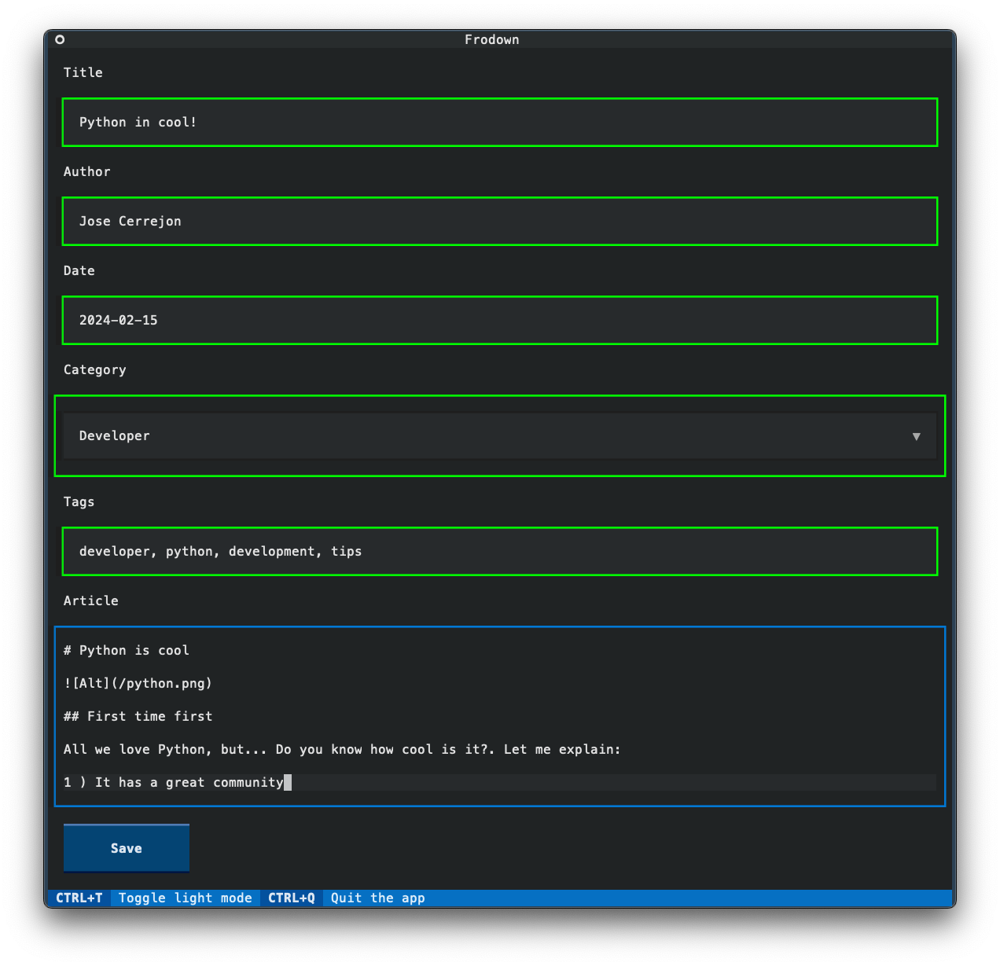

# Frodown



## Frontmatter + Markdown editor

This is a simple markdown editor with _Frontmatter_ support. It's built using _Python_ + a great _TUI (Terminal User Interface)_ called _Textual_. More info at [textualize.io](https://textualize.io).

It's the tool I use to write my blog posts and other markdown files. I built my blog using [VuePress 2](https://v2.vuepress.vuejs.org) + [Hope](https://theme-hope.vuejs.press) theme. You can visit me at https://misapuntesde.com

## Features

- [x] Frontmatter/Markdown support.
- [x] Dark/Light theme (because I think some people prefer brightness 🤷‍♂️).
- [x] Markdown zen mode & improvements on typewriting.
- [x] Auto-draft mode: Open with the latest options if you quit without saving the information previously.
- [x] Local AI to suggest tags using Ollama. 🤯

## TODO

- [x] Add a footer.
- [x] Save to a file.
- [x] Markdown cheat sheet on the sidebar.
- [x] Move categories and other constants to an environment or text file.
- [ ] If you have multi-language support on your site, create multiple markdown files.
- [ ] Accept parameters from the command line.
- [ ] Package it as a standalone app.

## Power UP! 🚀

Could an **application work as a server, from Terminal (TUI) AND with a _GUI_ on _macOS, Windows & Linux_, all at the same time?** It sounds crazy!! Let's do it!

- [ ] GUI App. 🚀
- [ ] Website App running as a web server.

## How to use

I chose the _TOML_ format for the settings, so please rename the file `settings.toml.example` and update the settings in your file.

Change the constants in the `main.py` and `categories.txt` files to match your needs. Then, run the following commands:

```bash
python -m venv venv
source venv/bin/activate
pip install -r requirements.txt
python main.py
```

Clicking on **[Save]** will save it to the same directory with the title 'slugged' and the extension '.md'.

If you want to use the AI to suggest tags, install [Ollama](https://github.com/ollama/ollama) and run the following command:

```bash
ollama run mistral:7b-instruct-v0.2-q4_K_S
```

## License and credits

Frodown 2024 by [Jose Cerrejon](https://github.com/jmcerrejon) is licensed under [CC BY-NC 4.0](http://creativecommons.org/licenses/by-nc/4.0/?ref=chooser-v1)

I'm using _Conventional Commits v1.0.0_. More information can be found at https://www.conventionalcommits.org/en/v1.0.0/.

This repository is hosted at _GitHub_. You can find the repository at https://github.com/jmcerrejon/frodown

You can use it for free on your own. If you want to support me, you can!:

- 🪙 [paypal.me/jmcerrejon](https://paypal.me/jmcerrejon)

- ☕️ [ko-fi.com > Buy me a coffee](https://ko-fi.com/cerrejon)

- 🟡 Bitcoin: 32XtfF8eKkWkAGJsHvBsjqsted5NKsGBcv
